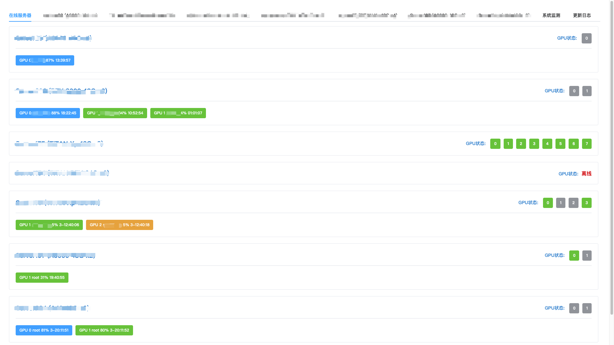

<div align="center">
<h1>GPU-Monitor</h1>
<p><em>实时查看模型训练状态、GPU资源占用、模型训练日志、IP访问记录等</em></p>
<p>欢迎各位 star fork pr </p>
</div>

## 主要特色

- [x] 轻量简洁：Flask+Sqlite3+Vue3+ElementUI-Plus
- [x] 快速接入：只需一行配置即可接入新的服务器
- [x] 休闲炼丹：实时掌握模型训练进度
- [x] 日志系统：跟踪模型loss变化，查看训练日志
- [x] IP统计：统计并展示IP访问情况，提高安全意识
- [x] 快速抢卡：实时预览GPU资源占用
- [x] 低资源消耗：多线程可控调度，CPU占用极低
- [x] 一键部署：docker一键部署
- [x] 自由拓展：适合新手练手项目

## 预览

### 首页

<table style="width: 100%">
<tr style="width: 100%;">
<td colspan="2" style="width: 100%;">

</td>
</tr>
</table>

### 日志系统

<table style="width: 100%">
<tr style="width: 100%;">
<td colspan="2" style="width: 100%;">

</td>
</tr>
</table>

### 日志管理

<table style="width: 100%">
<tr style="width: 100%;">
<td colspan="2" style="width: 100%;">

</td>
</tr>
</table>

### 查看日志

<table style="width: 100%">
<tr style="width: 100%;">
<td colspan="2" style="width: 100%;">

</td>
</tr>
</table>

### 系统监测

<table style="width: 100%">
<tr style="width: 100%;">
<td colspan="2" style="width: 100%;">

</td>
</tr>
</table>

### 更新日志

<table style="width: 100%">
<tr style="width: 100%;">
<td colspan="2" style="width: 100%;">

</td>
</tr>
</table>

## 部署方式

### Docker部署示例

#### 1. 构建镜像

```sh
docker-compose build
```

#### 2. 运行服务

```sh
docker-compose up -d
```

#### 3. 重新构建

```sh
docker stop gpumonitor_web & docker rm -f gpumonitor_web & docker rmi -f  219.216.65.59:5000/gpumonitor_web:latest & \
docker stop gpumonitor_server & docker rm -f gpumonitor_server & docker rmi -f  219.216.65.59:5000/gpumonitor_server:latest & \
```

## 赞赏

<table style="width: 100%">
<tr style="width: 100%">
<td style="width: 50%;text-align: center;">
支付宝

</td>
<td style="width: 50%;text-align: center">
微信

</td>
</tr>
</table>    

## 免责声明

本项目开源仅供学习使用，不得用于任何违法用途，否则后果自负，与本人无关。使用请保留项目地址谢谢。